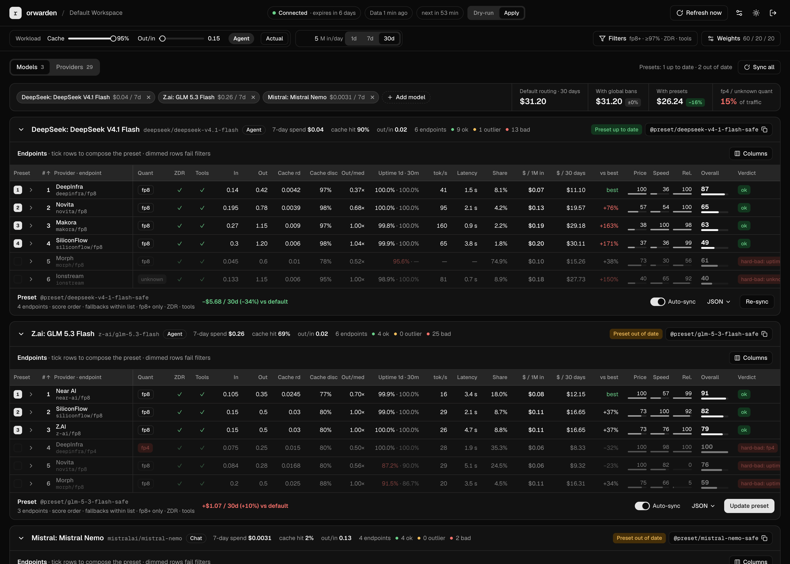

# orwarden

Self-hosted dashboard that keeps OpenRouter routing honest. It scores every provider endpoint of the models you use by price, speed and reliability, keeps a global provider ban list in the workspace default guardrail, and builds per-model presets (`@preset/<slug>`) that restrict each model to its most efficient providers without breaking the prompt cache mid-conversation.



## Run

```sh
cp .env.example .env   # set DASHBOARD_PASSWORD (8+ chars)
docker compose up -d
```

Upgrading an install that ran as `rerouter`: run `docker compose up -d --remove-orphans` once from the same directory so the old container is removed and stops holding the port. If the directory was renamed too, remove the old container by hand first (`docker rm -f rerouter-rerouter-1`). The existing `data/rerouter.db` keeps being used.

Open `http://127.0.0.1:3000`, log in with the password and paste an OpenRouter management key. The key is stored encrypted (AES-GCM, key derived from the dashboard password) in `data/orwarden.db` (an existing `data/rerouter.db` keeps being used). `OPENROUTER_MANAGEMENT_KEY` in `.env` is an optional fallback.

The server refreshes data on `REFRESH_CRON` (settings can override it). Scheduled refreshes run the ban optimizer with hysteresis; in `apply` mode they also patch the guardrail and sync presets marked as auto-sync. Manual actions in the dashboard always apply immediately.

## How it works

orwarden answers one question per model: which providers should serve it, so you pay as little as possible without getting quantized or unreliable output. Everything below uses the defaults from Settings; every number in brackets is configurable.

### Inputs

- **Snapshot.** On every refresh the server reads the workspace guardrail, your activity and, for every tracked model, all of its endpoints: prices (`p_in`, `p_out`, `p_cache`), quantization, 1-day and 30-minute uptime, throughput, latency, tool support and ZDR.
- **History.** Each refresh also stores hourly uptime, throughput and verdict per endpoint, and a price event whenever an endpoint appears, disappears or changes price or quantization. History covers tracked models only and is kept for 30 days; the last price before the window is kept so trends have a starting point.
- **Tracked models.** Models with traffic in the usage window (last `7` completed UTC days, 1–30) plus models you add by hand. Models you remove stay excluded.
- **Workload.** A model's traffic is described by three numbers:
  - `h` – cache hit ratio, cached input tokens / input tokens;
  - `r` – output/input ratio, output tokens (reasoning included) / input tokens;
  - input tokens per day.

  The workload bar at the top of the dashboard chooses the mode. *Actual* takes all three numbers from your activity (tokens over the window divided by the number of days; models without traffic fall back to `h = 0.5`, `r = 0.2` and the default volume). Moving the *Cache* or *Out/in* slider switches to a described workload with fixed `h`, `r` and a volume you choose (default 1M input tokens per day for every model). The label next to the sliders (Agent, RAG, Chat, Reasoning) is only a hint derived from `h` and `r`.

  The workload, the quality filters (min quantization, min uptime, tool calling, ZDR) and the score weights are **saved immediately** (with an Undo toast) and are the single rule set: the tables, presets, auto-sync and scheduled bans all use them. Only the period (1d / 7d / 30d) and *Hide banned providers* stay in the browser.

### Price of an endpoint

Cost per 1M input tokens for a workload:

```
C = (1 − h) · p_in + h · p_cache + r · p_out
```

Prices are per 1M tokens, so `C` already includes the cached part of the input and the output that the input produces. Money over a period is `C × tokens per day × days / 1M`.

The **effective price** divides by uptime, because a failed request is retried elsewhere: `C_eff = C / uptime`. Endpoints slower than `minTps` (off by default) are multiplied by `slowPenalty` (`1.2`) in the ban optimizer.

### Verdicts

Every endpoint is `ok`, `outlier` or `hard-bad`. Only `ok` endpoints can enter a preset.

- **Hard-bad**
  - quantization below the minimum (`fp8`; per-model exceptions such as `openai/gpt-oss → fp4` for models trained in low precision);
  - undisclosed quantization on an open-weight model (closed models have no quantization rules);
  - 1-day uptime below `97%`;
  - output price above `2.5×` the model median.
- **Outlier**
  - output price above `1.5×` the median;
  - cache price above `3×` the median when the model's cache hit ratio is above `0.3`.

Medians are taken over endpoints that pass the quantization rule.

Quantization ranks: `fp4/int4 < fp6 < fp8/int8 < fp16/bf16 < fp32`.

### Scores

Scores run from 0 to 100 and are relative to the eligible endpoints of the same model:

- **Price** = `100 × C_min / C`, where `C_min` is the cheapest eligible endpoint for the selected workload.
- **Speed** = `100 × (0.7 × tps / tps_max + 0.3 × latency_min / latency)`. An unknown throughput or latency counts as 30%.
- **Reliability** = `100 × (uptime − 0.9) / 0.1`, clamped to 0–100, with uptime = `0.8 × 1d + 0.2 × 30m`.
- **Stability** comes from the endpoint's own history over the last 30 days, not from other endpoints:
  - price part = `100 − 200 × (swing − 1) − 5 × changes` (changes capped at 5), where `swing` is the highest blended price `C` divided by the lowest;
  - uptime part = `100 − 15 × dip days − 5 × verdict flips`, where a dip day has an hourly uptime sample below the minimum uptime;
  - Stability = average of both parts, clamped to 0–100, pulled towards `50` while the endpoint is younger than 7 days (`50 + (raw − 50) × age / 7`). Endpoints without history score `50`.
- **Overall** = `(Price × w_price + Speed × w_speed + Reliability × w_rel + Stability × w_stab) / (w_price + w_speed + w_rel + w_stab)`. Weights are `60 / 20 / 20 / 10` by default. For open-weight models, `15` points are subtracted when the quantization is undisclosed.

### Presets: how the economical list is chosen

A preset is built per model from the saved workload, filters and weights, the same ones the tables show, so what you see is what gets written.

**Model rules.** *Model rules* above a model's endpoint table replaces any header value for that model only: workload (cache hit, output/input, volume), tool calling, min quantization, min uptime, ZDR, the four weights and *Top N providers*. Rules that are off follow the header. The model's prices, scores, estimate, change feed and preset all use its own rules. Global bans still use the global filters, because they apply to every model.

1. **Eligible.** The endpoint must:
   - have the verdict `ok`;
   - support tools when the preset workload needs them;
   - offer ZDR when *ZDR endpoints only* is on;
   - not belong to a provider in the global ban list;
   - not be left out by hand (see *Hand-picking* below).
2. **Ranking**, set by *Ranking* in Settings:
   - `score` (default): highest overall score first. Price weighs 60%, so this is "cheapest among fast and reliable".
   - `cost`: lowest effective price `C_eff` first, with the score as tie-breaker. This is the most economical option. Pick it if price is all that matters.

3. **Top N.** The first `5` (1–20) endpoints go into the preset, whatever their price. Fewer are listed only when fewer are eligible. Untick an expensive one by hand if it should not be there.
4. **Written config:**

   ```json
   {
     "model": "<model>",
     "provider": {
       "only": ["<tag 1>", "<tag 2>", "..."],
       "allow_fallbacks": true,
       "quantizations": ["<min quant and above>"],
       "require_parameters": true
     }
   }
   ```

   - `only` holds the selected tags, so requests never leave the list.
   - There is no `order`. OpenRouter turns off sticky routing when a preset sets a manual order, so every request would go back to #1 and a conversation that fell back to another provider would lose its prompt cache twice. Without `order`, OpenRouter keeps a conversation (keyed by `session_id`, or by its first messages after a cache hit) on the provider that holds its cache. OpenRouter, not orwarden, chooses which listed provider serves a new conversation, so the preset is priced at its most expensive member.
   - `allow_fallbacks` moves to another endpoint in the list when one fails.
   - `quantizations` is omitted for closed models and when an endpoint reports a non-standard quantization name.
   - `require_parameters` is set only for tool workloads.

**Keeping a dropped provider while its cache is warm.** Removing a provider from `only` moves its running conversations to another provider, which reads their whole context again at the full input price. So when a sync would drop a provider, orwarden first asks OpenRouter's analytics (`POST /analytics/query`, per minute, by model and provider) whether that provider served the model in the last 15 minutes (the 10-minute sticky window plus reporting lag).

- Used recently: the provider stays in `only`, marked *held*, and is checked again at the next sync.
- Not used: it goes now, because no conversation is pinned to it any more.
- Not eligible any more (banned, failed a filter, excluded by hand): it goes now, warm or not.
- A hold ends after *Keep dropped providers* hours (24 by default) or once the extra spend passes the dollar limit ($1 by default). Extra spend is what the provider was paid since the hold started, times its premium over the most expensive provider of the new list.
- When analytics cannot be read, a hold stays until its time limit.

Held providers count towards the preset price, because their conversations really pay that price. Analytics are queried only when a sync would drop something.

**Hand-picking.** The numbered tick in the first column of the endpoint table adds or removes an endpoint. After the first change the preset contains exactly the ticked endpoints (still in score order, only eligible ones, at most 20) until you press *Reset to top N*.

**Price of a preset.** OpenRouter picks the provider inside the list, and in practice sends new conversations to one of them, so the preset is priced at its worst case:

```
price = max_i C_i
```

This is the "With presets" figure; the real cost is at most this. It is compared with:

- **Default routing:** what OpenRouter does without a preset. It spreads traffic across all non-ignored endpoints with weight `uptime / p²`, where `p` is `p_in` by default (`optimizer.routingPrice` in the settings API switches it to `p_in + p_out` or the blended `C`).
- **With global bans:** the same spread after the ban list is applied.

**Range and risks.** Every preset estimate also carries a low end, a high end, a confidence (high, medium, low) and the risks behind them. The low end is the cheapest listed provider. The high end adds the money each risk can cost:

| Risk | Source | Added to the high end |
| --- | --- | --- |
| `routing` | OpenRouter picks the provider inside the list | nothing, it explains the low–headline gap |
| `price-volatility` | listed providers changed price in the last 30 days | headline × (largest swing − 1) |
| `fallback-cache` | a listed provider can fail and the request re-reads its cached context elsewhere | worst downtime × `h` × (`p_in` − `p_cache`) × volume |
| `workload-drift` | the daily cache hit and output/input ratio of your traffic vary | cost at `h − σ`, `r + σ` minus the headline |
| `default-model` | default routing is a model of OpenRouter's spread | nothing, it shows the range the default could have |
| `calibration` | your real spend over the usage window differs by more than 5% from what the model predicts for the same traffic (the preset range when the preset was synced before the window, default routing otherwise) | headline × error, when the model underestimated |
| `thin-data` | providers younger than 7 days, or no recent traffic | nothing, it lowers confidence |

Confidence is low when any risk is bad (a price swing of 25% or more), medium when any risk is a warning or data is thin, and high otherwise. The summary uses the risks of models that make up at least 5% of the preset spend.

### Price changes

The *Changes* tab lists every price change, new provider and removed provider of your tracked models over the last 30 days, newest first. Input and output show the old and new price; *At workload* is the change of the blended price `C` at the saved workload. By default only significant changes are shown: a blended or output move of `10%` or more, a quantization change, or a provider that appeared or disappeared.

Each refresh, manual or scheduled, sends the significant changes it found to the configured alert channels.

### Global bans

The ban optimizer writes the guardrail's `ignored_providers`:

- **Objective.** Each model's spend is the usage-weighted average of `C_eff × penalty`, with `r` raised to at least `0.5` so that output-heavy outliers always count. The penalties are `×3` for hard-bad, `×5` for an output outlier and `×1.5` for a cache outlier. The averaging uses the default routing weights.
- **Search.** A greedy search adds or removes one provider at a time while that lowers the objective by at least `1%`, for at most `20` moves.
- **Constraint.** A model may never drop below `2` good endpoints, or below what it has if it has fewer. No model may lose all of its endpoints.
- **Low-quant providers.** Providers that only serve below-minimum quantization are banned first (`filters.banLowQuantProviders`, on by default).
- **Manual policies.** *Ban* and *Allow* on the Providers tab override the optimizer.
- **Hysteresis.** Scheduled runs ban a provider after it was a candidate `2` runs in a row and unban after `3` clean runs. They change at most `3` providers per run.

The Providers tab shows, for every provider, how the cost of all tracked models changes if it is banned. A provider "blocks" a model when banning it would leave that model with no endpoint.

### Which options save money

| Goal | Setting |
| --- | --- |
| Cheapest preset regardless of speed | Settings → Ranking: `cost`, or raise the price weight |
| Fewer, cheaper fallbacks | Lower *Top N providers* (globally or in *Model rules*) or untick expensive endpoints; the preset price is set by its most expensive member |
| Price your real mix | Keep *Actual* on the workload bar, or move the sliders to describe your client (agents: high cache, short answers) |
| Accept cheaper low-precision providers | Lower min quantization (quality risk; shown as "Risk" on the Models tab) |
| Spend less on retries | Keep min uptime high; `C_eff` already charges for downtime |

## Develop

```sh
bun install
DASHBOARD_PASSWORD=devpassword bun run dev:server
bun run dev:web        # Vite on :5173, proxies /api to :3000
bun run test
```

`vue-tsc` needs Node: `cd web && npx vue-tsc --noEmit`.

The frontend uses Vue 3.6 (Vapor mode, release candidate), shadcn-vue, Tailwind CSS 4 and a typed Hono RPC client (`web/src/lib/api.ts`).

## API

All routes live under `/api` and require a session cookie except `/api/auth/*`.

| Method | Path | Purpose |
| --- | --- | --- |
| POST | `/auth/login`, `/auth/logout` | Session |
| GET | `/auth/session` | Session state |
| GET | `/status` | Key, workspace, last run, errors |
| PUT/DELETE | `/key` | Store or remove the management key |
| GET/PUT | `/settings`, POST `/settings/reset` | Settings |
| POST | `/refresh` | Pull fresh data (`{ full: true }` runs the scheduled cycle) |
| GET | `/catalog?q=` | Model search for the watchlist |
| GET | `/overview` | Models with endpoint scores, costs and scenarios |
| GET | `/history?model=` | Price and uptime history |
| GET | `/trend?model=` | Price events and daily uptime for the last 30 days |
| GET | `/changes` | Price changes of tracked models over the last 30 days |
| GET | `/providers` | Provider table with ban effects |
| PUT | `/providers/:slug/policy` | `ban`, `allow` or `null` |
| POST | `/bans/apply`, `/bans/rollback` | Write the guardrail |
| GET | `/bans/history` | Runs and decisions |
| GET | `/presets` | Preset plans and remote status |
| PUT | `/presets/settings` | Slug, auto-sync, picked (hand-picked endpoints, `null` resets) |
| POST | `/presets/sync` | Create or update presets on OpenRouter |
| POST | `/alerts/test` | Send a test alert |

View queries default to the saved workload, filters and weights (`PUT /settings` with `workload`, `filters`, `scoring`). They accept `days` and `hideBanned`; the other overrides (`scenario`, `h`, `r`, `tools`, `tokensPerDay`, `minQuantization`, `minUptime`, `zdrOnly`, `wPrice`, `wSpeed`, `wReliability`) still work for ad-hoc API calls but presets and sync ignore them.

## License

[MIT](LICENSE)
